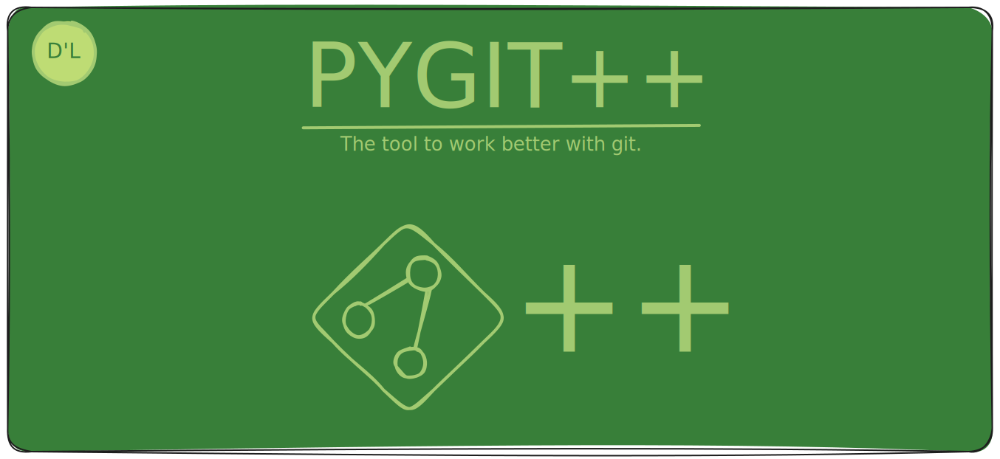

<p align="center">
    
    
    <p>
        > [!WARNING]
        > This program is not even in alpha; much of it is still incomplete work
    </p>
    
    <p>
        [](https://app.codacy.com/gh/thelibertti/pygit-/dashboard?utm_source=gh&utm_medium=referral&utm_content=&utm_campaign=Badge_grade)
    </p>
</p>

# PYGIT++
**Pygit++ can be defined as simple as just as a better user
experience for git.**


# Get this buggy thing goin!

Before starting make sure you have the following external
dependencies

- [bat](https://github.com/sharkdp/bat)


## Automatic installation (Linux only)

**There is a binary options for users simple
run the following command in your terminal
and it will build and set up the binary for you:**


```bash
curl -sSL https://raw.githubusercontent.com/thelibertti/pygit-/main/father.sh | bash
```


**Please notice that you will need the following 
dependencies in your system**

- [curl](https://curl.se/)
- [unzip](https://linux.die.net/man/1/unzip)
- [wget](https://linux.die.net/man/1/wget)
- [python](https://www.python.org/)
- [python-venv](https://docs.python.org/3/library/venv.html)


(Note: pygit++ will be installed in ```usr/local/bin``` or in ```$PREFIX/bin``` in 
case you are in Termux)

## Manual Compilation (Windows and Linux users)

For manual compilation 

first clone this repo with:

```bash
git clone https://github.com/thelibertti/pygit-
```

then go into the repo and run: 

```bash
pip install -r requirements.txt
```

the you can run:

```bash
pyinstaller --strip --name pygit++ main.py
```

After that you should see a bunch of new directories 
go into `dist/` and there you should find the pygit++ directory,
inside `pygit++/` you will find the binary and the dependencies 
in `_internal/`, now you can decide where to place both the binary 
and the dependencies.


##  For DEVS (Linux and Windows users)

First clone this repo:

```bash
git clone https://github.com/thelibertti/pygit-
```

install the dependencies with

```bash
pip install -r requirements.txt
```

## Add it to your path!

**Linux:**
look for your shell configuration file such as '.zshrc' or '.bashrc'
in your home directory and open it, and add the next line:
```bash
alias pygit="python [path_to_the_pygit++_dir]/main.py"
```


**Windows**
Run in powershell:
```powershell
notepad $PROFILE
```

There add the next line:
```powershell
Set-Alias pygit "python [path_to_the_pygit++_forder/main.py]"
```

(Make sure to change the path to where main.py is 
located and remove the square brackets)

And that’s it, you’re good to go!

## HELP?

##### Try ```pygit -h``` or see the DOCS


## Contributing

In case you found a bug you can open an issue and we will try to help
you as soon as posible. 

In case you want to contribute to this project there is a template
for the contributions in [Contributions](DOCS/contributions.md)
